# LuminaGI

**Real-Time Global Illumination Inspired by Unreal Engine 5 Lumen**

LuminaGI is a real-time global illumination system built on a custom C++/DirectX 12 engine ([Igloo Engine](https://github.com/CarlottaSeal/Igloo)). It achieves multi-bounce diffuse indirect lighting at interactive frame rates (1920x1080) using software ray tracing, no hardware ray tracing (DXR) required.

This project is my thesis work at SMU Guildhall.

| Direct Lighting Only | Full Global Illumination |
|---|---|
| 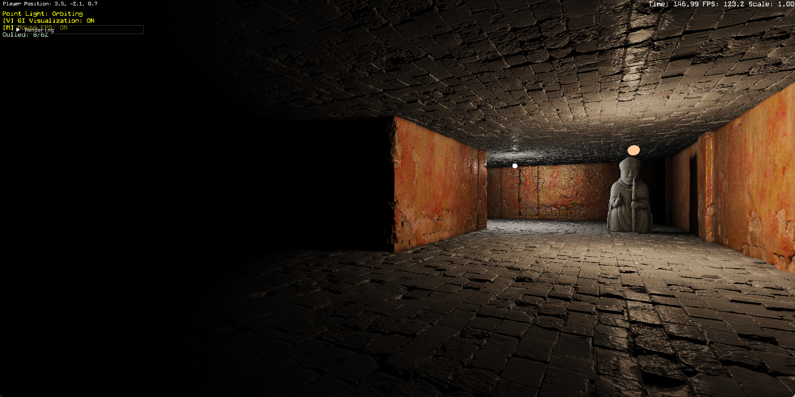 | 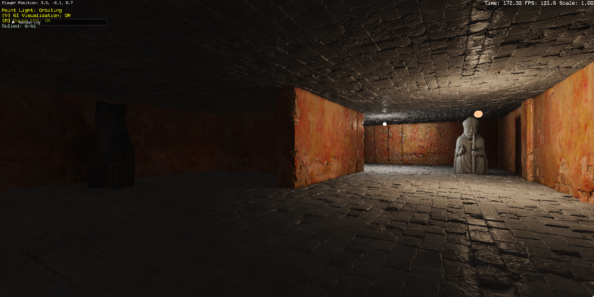 |

| Color Bleeding | Point Light Shadow |
|---|---|
| 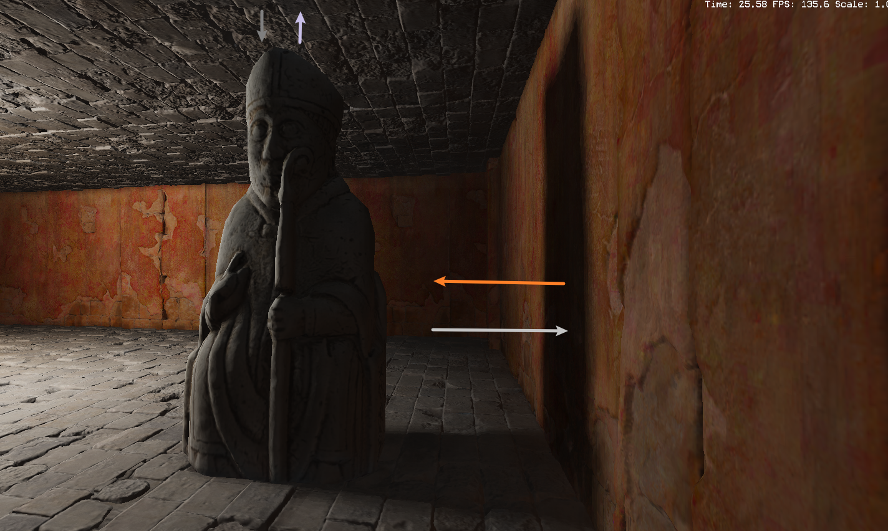 | 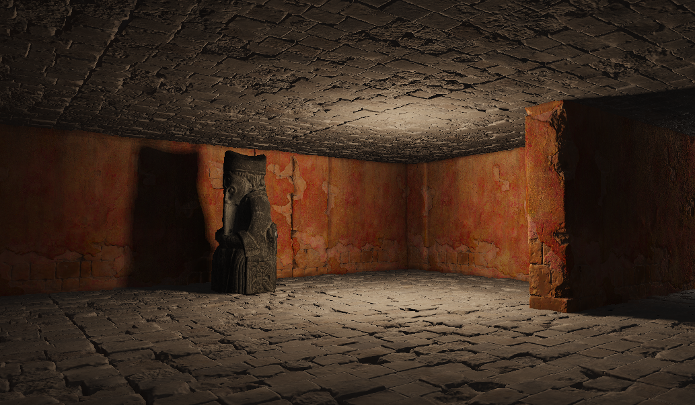 |
| *Multi-bounce indirect color transfer* | *Omnidirectional cube shadow maps* |

## Key Features

- **Screen-Space Probe System**: 11-pass compute pipeline: 240x135 probe grid, 64 rays per probe (~2M rays/frame) sampled via joint BRDF + lighting PDF; temporal blend + bilateral spatial filter weighted by depth and normal
- **Surface Cache**: 4096x4096 texture atlas with 6 layers (albedo, normal, material, direct light, indirect light, combined), tile-based allocation (64x64 tiles, up to 4096 cards)
- **Signed Distance Field Tracing**: Per-mesh SDF generation (64x64x64 cubic volume) with BVH acceleration; global SDF composition (64x64x64) for coarse long-range tracing
- **Voxel Irradiance Volume**: 64x64x64 world-space stable 3D irradiance grid (RGBA16F), serving as fallback when mesh SDF misses
- **Surface Radiosity**: Multi-bounce indirect lighting via 1024x1024 probe grid on the surface cache atlas; L1 SH (4 coefficients/channel) for compact directional irradiance; amortized execution (every 10 frames) with distance-based falloff to suppress corner over-brightening
- **Dynamic Point Lights**: Moving point light support with incremental dirty-card relighting, 128-bit per-card light masks, distance-priority scheduling, and a tile-granularity card index lookup texture (64x64 R32_UINT) that eliminates the O(n) per-thread card search in the DirectLightUpdate shader
- **Shadow System**: Directional shadow maps (2048x2048, 3x3 PCF) + omnidirectional point light cube shadows (512x512 per face, 6 faces per light, up to 4 lights, rendered per-face with separate draw calls)
- **Instanced Indexed Drawing**: Frustum culling, sort-by-material batching, structured buffer instance data
- **GI Visualization System**: 17 runtime debug visualization modes across 5 categories, switchable via ImGui panel

## Architecture

```
LuminaGI
├── Code/Game/
│   ├── App.cpp / Game.cpp        # Application entry, subsystem init
│   ├── LuminaScene.cpp           # Scene setup, light config, rendering
│   └── Player.cpp / Statue.cpp   # Camera control, scene objects
│
└── Run/Data/Shaders/             # 44 HLSL/HLSLI files
    ├── ScreenProbe/              # 11-pass screen probe pipeline
    │   ├── ProbePlacement.hlsl
    │   ├── BRDFPDFGeneration.hlsl
    │   ├── LightingPDFGeneration.hlsl
    │   ├── GenerateSampleDirections.hlsl
    │   ├── MeshSDFTrace.hlsl
    │   ├── VoxelSDFTrace.hlsl
    │   ├── RadianceComposite.hlsl
    │   ├── TemporalAccumulation.hlsl
    │   ├── SpatialFilter.hlsl
    │   ├── OctIrradiance.hlsl
    │   ├── FinalGather.hlsl
    │   └── ScreenSpaceTemporalFilter.hlsl
    ├── SurfaceRadiosity/         # Multi-bounce radiosity
    ├── GIVisualization/          # Debug visualization shaders
    ├── DirectLightUpdate.hlsl    # Per-card point light evaluation
    ├── CardCapture.hlsl          # Surface cache capture
    ├── SDFGeneration.hlsl        # Mesh SDF baking
    ├── BuildGlobalSDF.hlsl       # Global SDF composition
    ├── InjectVoxelLighting.hlsl  # Voxel irradiance injection
    ├── PointLightShadow.hlsl     # Cube shadow map rendering
    └── Shadow.hlsl               # Directional shadow pass
```

The GI system is implemented in the [Igloo Engine](https://github.com/CarlottaSeal/Igloo) under `Engine/Renderer/GI/`, `Engine/Renderer/Cache/`, and `Engine/Scene/SDF/`.

## Screen Probe Pipeline

| Pass | Shader | Operation |
|------|--------|-----------|
| 1 | ProbePlacement | Reconstruct world position per 8x8 pixel cell |
| 2 | BRDFPDFGeneration | Cosine-weighted Lambertian distribution |
| 3 | LightingPDFGeneration | History reprojection from previous frame |
| 4 | GenerateSampleDirections | 64 rays/probe via joint BRDF + lighting PDF (0.5/0.5) |
| 5 | MeshSDFTrace | Sphere trace per-mesh SDFs (0-100 units) |
| 6 | VoxelSDFTrace | Sphere trace global SDF (100-500 units) |
| 7 | RadianceComposite | Blend voxel + surface cache radiance, 1/pi clamp |
| 8 | TemporalAccumulation | Exponential moving average with history buffer |
| 9 | SpatialFilter | 4-neighbor cross-bilateral filter (depth + normal weights) |
| 9B | OctIrradiance | SH low-pass: L2 projection (9 coeff/channel) + reconstruction |
| 10 | FinalGather | 4-probe bilinear blend to per-pixel irradiance |
| 11 | ScreenSpaceTemporalFilter | Motion-aware temporal reprojection, 1/pi clamp |

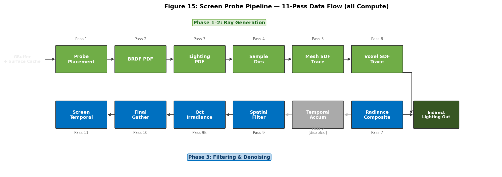

## Surface Cache Layers

4096x4096 atlas, 6 layers per texel:

| Layer | Contents | Format |
|-------|----------|--------|
| 0 | Albedo | RGBA8 |
| 1 | World-Space Normal | RGBA16F |
| 2 | Material (roughness / metallic / AO) | RGBA8 |
| 3 | Direct Light | RGBA16F |
| 4 | Indirect Light (from radiosity) | RGBA16F |
| 5 | Combined Light | RGBA16F |

| Albedo | Normal | Direct Light | Combined |
|---|---|---|---|
| 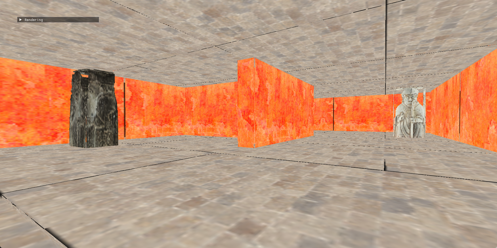 | 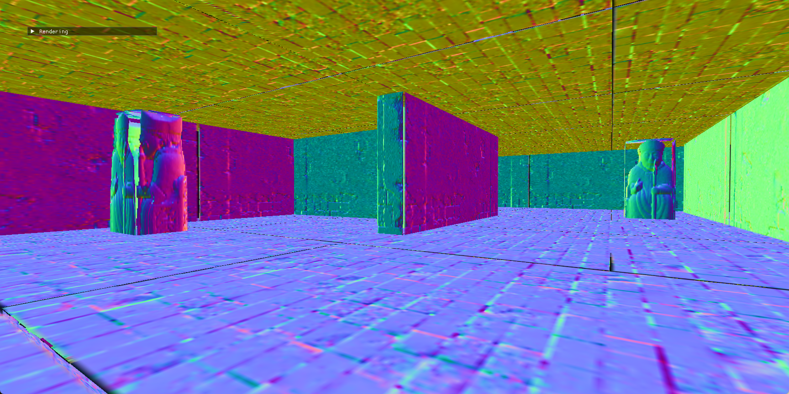 | 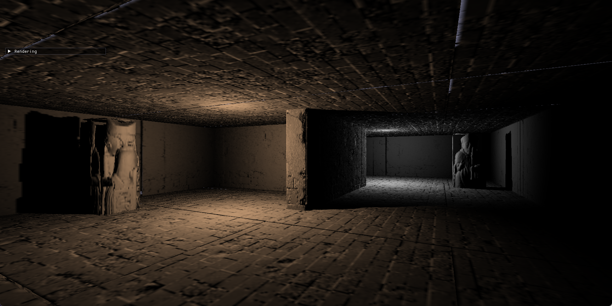 | 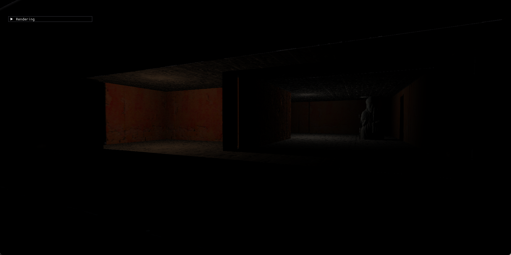 |

## GI Visualization System

17 real-time visualization modes toggled via ImGui panel, using two execution paths: fullscreen compute for screen-space/volumetric modes, and instanced VS/PS rasterization for surface cache modes.

| Category | Modes |
|----------|-------|
| Output (3) | Final Lighting, Direct Only, Indirect Only |
| Surface Cache (5) | Albedo, Normal, Direct Light, Indirect Light, Combined |
| Volumetric (2) | Voxel Lighting, Radiosity Trace |
| Screen Probe (5) | BRDF PDF, Lighting PDF, MeshSDF Trace, Radiance Oct, Radiance Filtered |
| Per-subsystem (2) | MeshSDF Normal, Probe AO |

## Rendering Pipeline

| Order | Pass | Type | Frequency |
|-------|------|------|-----------|
| 1 | Directional Shadow Map (2048x2048) | Rasterization | On sun change |
| 2 | Point Light Cube Shadow (512x512 x 24) | Rasterization | Every frame |
| 3 | GBuffer | Rasterization | Every frame |
| 4 | Card Capture (dirty cards only) | Rasterization | On change |
| 5 | Direct Light Update | Compute | On light change |
| 6 | Global SDF + Voxel Lighting Injection | Compute | Every frame |
| 7 | Surface Radiosity (Trace + Filter + SH + Integrate) | Compute | Every 10 frames |
| 8 | Combine Surface Cache | Compute | After update |
| 9 | Screen Probes (11 passes) | Compute | Every frame |
| 10 | Final Composite | Full-screen PS | Every frame |

## Scene Complexity

The test scene consists of a 6x4 grid of floor and ceiling tiles (38 instances of a 12,324-triangle stone tile mesh), 23 perimeter and interior wall segments (43,320 triangles each), and one 49,950-triangle character model: totaling approximately **1.5 million triangles** across **62 mesh instances**.

## Performance

Measured in windowed mode (~1728x864, 2:1 aspect at 90% of a 1080p desktop) on a desktop NVIDIA GPU:

| Component | GPU Time |
|-----------|----------|
| Screen Probe Pipeline (total) | ~5.3 ms |
| &nbsp;&nbsp;Mesh SDF Trace | 2.8 ms |
| &nbsp;&nbsp;Final Gather | 0.5 ms |
| &nbsp;&nbsp;Radiance Composite | 0.5 ms |
| Point Light Cube Shadows | 1.0-2.0 ms |
| Direct Light Update | 0.2-0.4 ms |

| MeshSDF Normal | Voxel Lighting |
|---|---|
| 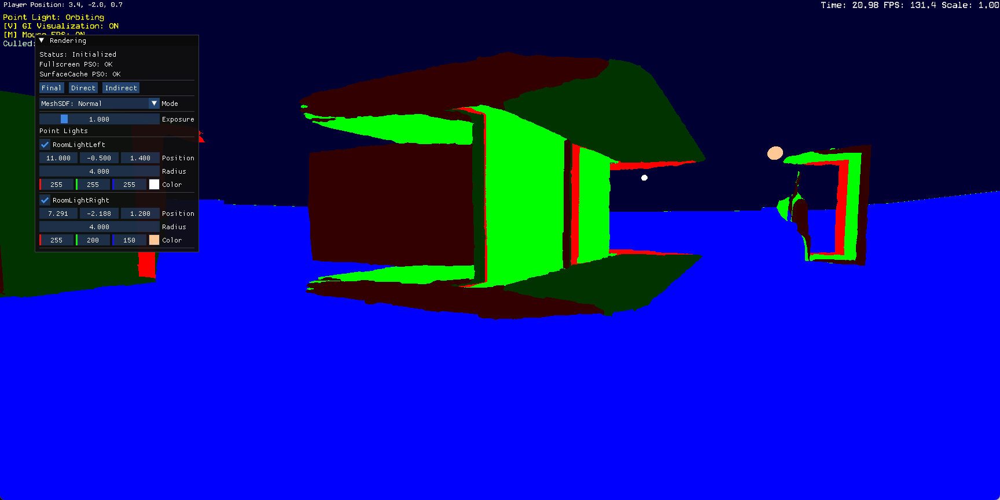 | 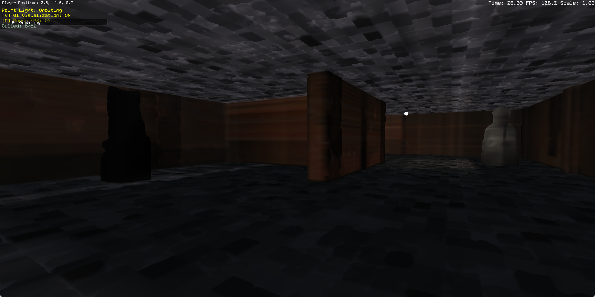 |

## Implementation Notes

**Importance Sampling**
Each screen probe samples 64 ray directions via a joint PDF combining a BRDF term (cosine-weighted Lambertian) and a lighting PDF derived from the previous frame's radiance history. The two terms are weighted equally (0.5/0.5). This reduces variance compared to uniform hemisphere sampling without requiring hardware ray tracing.

**Bilateral Filtering**
The spatial filter uses a 4-neighbor cross pattern with bilateral weights:
```
depth_weight  = exp(-plane_distance * 10.0)
normal_weight = pow(saturate(dot(n1, n2)), 4.0)
```
Center weight 1.0; neighbors contribute with their bilateral weight. Preserves edges at depth discontinuities and surface orientation boundaries.

**SH Resolution Trade-off**
Screen probes use L2 SH (9 coefficients/channel) in the OctIrradiance pass for low-pass smoothing. Surface radiosity uses L1 SH (4 coefficients/channel) on the surface cache atlas — sufficient for low-frequency diffuse indirect lighting and cheaper to store/evaluate per atlas texel.

**Dirty Card States**
Two dirty flags per card: geometry-dirty (object moved -> full re-render of albedo/normal/material/direct light layers via rasterization) and lighting-dirty (light moved -> compute-only direct light update, skipping rasterization entirely). Moving a point light suppresses full card recapture and routes through the compute path only.

**DirectLightUpdate Card Index Lookup**
The DirectLightUpdate compute pass originally dispatched 512x512 thread groups over the full 4096x4096 atlas, with each thread performing a linear scan through all active card metadata entries to find which card owned its texel. At 372 active cards this produced ~6.2 billion structured buffer reads per dispatch, causing a 33ms single-frame spike on every light update. The fix is a 64x64 `R32_UINT` lookup texture (16 KB) where each texel stores the owning card index for that atlas tile (`0xFFFFFFFF` = empty). Each thread now does a single `Texture2D.Load` at `atlasCoord / 64` instead of the full scan, reducing memory accesses from 6.2B to 16.7M and eliminating the spike.

**Surface Radiosity Amortization**
The radiosity trace dispatches 256x256 thread groups over the full 4096x4096 atlas, which is expensive. To maintain frame rate, the pass executes only every 10th frame and uses a convergence mechanism: after 30 dispatches (300 frames) without lighting changes, the pass stops entirely. A distance-based quadratic falloff (`distFade = (hitDist / refDist)^2`) suppresses corner over-brightening caused by near-field hits in tight geometry junctions.

**Firefly Clamping**
All pipeline stages clamp output luminance to 1/pi (approximately 0.318), the physical maximum of the Lambertian BRDF. This prevents any stage from producing radiance above the diffuse surface limit, eliminating firefly artifacts without an arbitrary threshold.

**Codebase Scale**
- LuminaGI shaders: 44 HLSL/HLSLI files across root and 4 subdirectories
- Engine GI/Cache/SDF subsystems: ~6,000 lines C++
- Total engine: ~180,000 lines C++

## Build Requirements

- **OS**: Windows 10/11
- **IDE**: Visual Studio 2022
- **Graphics API**: DirectX 12 (Feature Level 12_0)
- **GPU**: Any DX12-capable GPU (no DXR required)
- **Dependencies**: [Igloo Engine](https://github.com/CarlottaSeal/Igloo) (sibling directory expected at `../Engine`)

### Build Steps

1. Clone both repositories as siblings:
   ```
   git clone https://github.com/CarlottaSeal/Igloo.git Engine
   git clone https://github.com/CarlottaSeal/LuminaGI.git LuminaGI
   ```
2. Open `LuminaGI/LuminaGI.sln` in Visual Studio 2022
3. Build in **Release** or **Debug** configuration (x64)
4. Run from the `Run/` directory

## Known Limitations

- SDF representation cannot accurately capture thin geometry or highly concave surfaces
- Global SDF at 64x64x64 resolution causes voxel light bleeding through thin walls and coarse gradient normals on small objects
- Fixed probe density (one per 8x8 pixels) may undersample high-frequency lighting variation
- Point light shadow maps are hard-limited to 4 simultaneous shadow-casting lights
- Surface radiosity corner brightening is mitigated but not eliminated by the distance falloff

## Inspired By

- [Lumen (Unreal Engine 5)](https://advances.realtimerendering.com/s2022/SIGGRAPH2022-Advances-Lumen-Wright%20et%20al.pdf): Wright, Narkowicz, Jimenez (SIGGRAPH 2022)
- [GI-1.0](https://gpuopen.com/download/publications/GPUOpen2022_GI1_0.pdf): Boisse (AMD GPUOpen, 2022)

## License

This project is part of a thesis at SMU Guildhall. All rights reserved.
